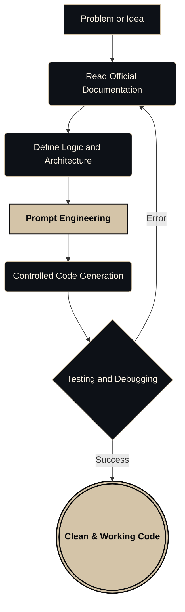

<div align="right">
  <a href="README.md">Português</a> | <strong>English</strong>
</div>

<div align="center">


```text
██╗  ██╗       ██████╗ ██████╗ ██████╗ ███████╗██████╗ 
██║  ██║      ██╔═══██╗██╔══██╗██╔══██╗██╔════╝██╔══██╗
███████║█████╗██║   ██║██████╔╝██║  ██║█████╗  ██████╔╝
██╔══██║╚════╝██║   ██║██╔══██╗██║  ██║██╔══╝  ██╔══██╗
██║  ██║      ╚██████╔╝██║  ██║██████╔╝███████╗██║  ██║
╚═╝  ╚═╝       ╚═════╝ ╚═╝  ╚═╝╚═════╝ ╚══════╝╚═╝  ╚═╝
```

[](#)
[](#)
[](#)

<br>

### BACKEND DEVELOPER & PROMPT ENGINEERING

</div>

---

## ABOUT ME

I am 15 years old and passionate about logic, backend development, and automation.

I started by breaking and fixing scripts in Termux, and I learned the hard way that just copying and pasting AI-generated code doesn't work. To build something real, you need to understand the foundation.

My current focus is using **Prompt Engineering** technically. Instead of asking AI to "build a system", I read the documentation, define the architecture, set strict rules, and use AI purely as a controlled code-generation engine.

---

## MY STACK AND TOOLS

I don't believe in listing 20 languages without projects to prove it. Here is what I actually use and what I am currently learning:

### Core (What I use daily)
*   **AI & Prompt Engineering:** ChatGPT, Claude (Focus on RAG and reducing hallucinations).
*   **Languages:** Python, JavaScript, Node.js.
*   **Data:** JSON, YAML.

### Exploring / Studying (Where I am diving deeper)
*   **Low/Mid-Level Languages:** C, C++, Java.
*   **Frontend:** React, TypeScript, HTML, CSS.

---

## HOW I DEVELOP (MY CYCLE)

My process to avoid bugs and useless AI-generated code:



---

## CURRENTLY BUILDING (MY LAB)

I am currently organizing my local scripts and studies to publish them here on GitHub. Soon, this section will be updated with real projects focused on:

### 1. [Coming Soon] Python Automation
*   **Focus:** Creating scripts to automate repetitive tasks using external APIs.

### 2. [Coming Soon] AI Integration with Node.js
*   **Focus:** A simple backend that consumes the OpenAI/Anthropic API using strict prompt rules.

### 3. [Coming Soon] C/C++ Studies
*   **Focus:** Basic algorithms and understanding memory management to strengthen my logical foundation.

<br>
<div align="center">
  
</div>
