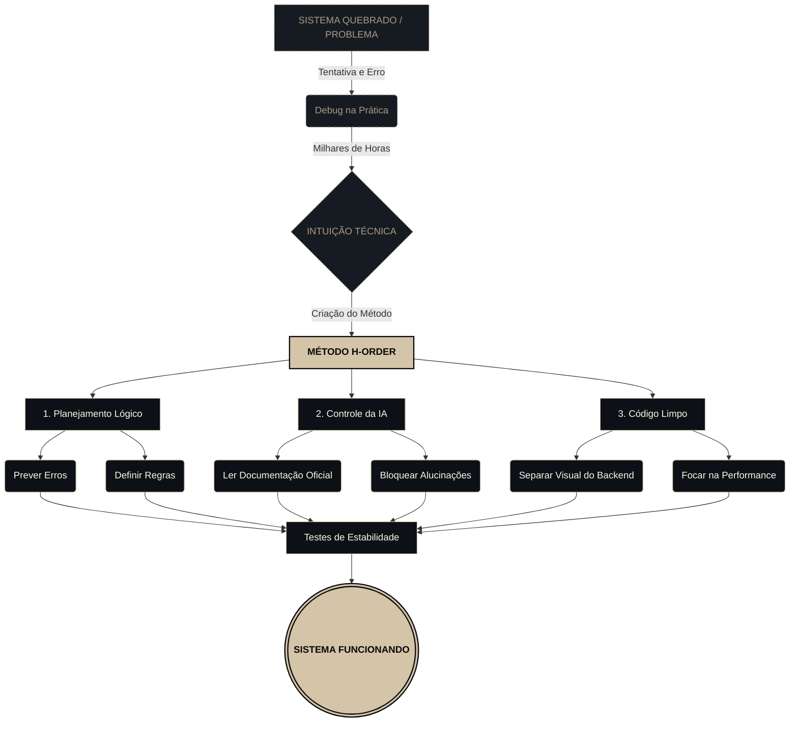

<div align="right">
  <strong>Português</strong> | <a href="README-en.md">English</a>
</div>

<div align="center">


```text
██╗  ██╗       ██████╗ ██████╗ ██████╗ ███████╗██████╗ 
██║  ██║      ██╔═══██╗██╔══██╗██╔══██╗██╔════╝██╔══██╗
███████║█████╗██║   ██║██████╔╝██║  ██║█████╗  ██████╔╝
██╔══██║╚════╝██║   ██║██╔══██╗██║  ██║██╔══╝  ██╔══██╗
██║  ██║      ╚██████╔╝██║  ██║██████╔╝███████╗██║  ██║
╚═╝  ╚═╝       ╚═════╝ ╚═╝  ╚═╝╚═════╝ ╚══════╝╚═╝  ╚═╝
```

[](#)
[](#)
[](#)

<br>

### ARQUITETURA DE SISTEMAS, ENGENHARIA DE PROMPT E LÓGICA DE BACKEND

</div>

---

## MANIFESTO: A LÓGICA DA ORDEM

A maioria das pessoas usa Inteligência Artificial como se fosse mágica. Eu uso como um processador que precisa de regras estritas. 

O método **H-ORDER** serve para organizar o caos. Em vez de pedir para a IA gerar código aleatório e torcer para funcionar, eu desenho a arquitetura e a lógica do sistema primeiro. Mapeando as regras antes de escrever a primeira linha de código, elimino 90% dos bugs e falhas.

> *"A linguagem de programação muda; a lógica estrutural é o que mantém o sistema de pé."*

---

## COMO EU TRABALHO (HABILIDADES PRÁTICAS)

### 1. INTUIÇÃO TÉCNICA (CONSTRUÍDA NA RAÇA)
Meu conhecimento não veio apenas de teoria, mas de mais de 3.000 horas de debug real. Após anos resolvendo sistemas quebrados no Termux e corrigindo APIs, desenvolvi a habilidade de ler um erro e saber exatamente onde o sistema vai falhar antes mesmo de rodar o código.

### 2. IA CONTROLADA (SEM ALUCINAÇÕES)
IAs inventam funções que não existem se você deixar. Eu resolvo isso forçando a IA a ler documentações oficiais (Changelogs, APIs atualizadas) antes de me dar uma resposta. Isso garante que o código gerado seja real, atualizado e pronto para produção.

### 3. FOCO NO MOTOR (BACKEND E LÓGICA)
A base do meu trabalho é a Engenharia de Prompt focada no motor do sistema. Eu construo a lógica, o banco de dados e as regras de negócio primeiro. A interface visual é apenas uma consequência de um backend bem feito.

*   **Inteligência Artificial & Prompt:** <br>
      
*   **Motor & Backend:** <br>
        
*   **Interface (Frontend):** <br>
        
*   **Estrutura de Dados:** JSON, YAML, XML.

---

## O QUE EU ENTREGO (SERVIÇOS E SOLUÇÕES)

*   **Arquitetura de Software:** Desenho de sistemas do zero, definindo banco de dados, rotas e regras de negócio.
*   **Automações e Scripts:** Criação de rotinas em Python ou Node.js para tarefas repetitivas.
*   **Integração de APIs:** Conexão de sistemas diferentes de forma segura e rápida.
*   **Refatoração com IA:** Uso de IA para limpar, otimizar e documentar códigos legados ou confusos.

---

## WORKFLOW DE EXECUÇÃO (MÉTODO H-ORDER)

Como transformo um problema complexo em uma solução estável:



---

## REGISTRO DE OPERAÇÕES (PROJETOS)

Abaixo estão listadas arquiteturas e automações desenvolvidas sob a metodologia H-ORDER:

### 1. [NOME_DO_PROJETO_01]
*   **Status:** `[Operacional / Em Desenvolvimento]`
*   **Stack:** `[Ex: Python + OpenAI API]`
*   **Descrição:** [Insira aqui uma breve descrição de 1 ou 2 linhas sobre o problema que o projeto resolve e como a IA foi orquestrada para isso.]
*   **Link:** [Repositório ou Demo](#)

### 2. [NOME_DO_PROJETO_02]
*   **Status:** `[Operacional / Em Desenvolvimento]`
*   **Stack:** `[Ex: React + Node.js]`
*   **Descrição:** [Insira aqui uma breve descrição de 1 ou 2 linhas sobre o problema que o projeto resolve e como a IA foi orquestrada para isso.]
*   **Link:** [Repositório ou Demo](#)

### 3. [NOME_DO_PROJETO_03]
*   **Status:** `[Operacional / Em Desenvolvimento]`
*   **Stack:** `[Ex: C++ + Bedrock]`
*   **Descrição:** [Insira aqui uma breve descrição de 1 ou 2 linhas sobre o problema que o projeto resolve e como a IA foi orquestrada para isso.]
*   **Link:** [Repositório ou Demo](#)

<br>
<div align="center">
  
</div>
