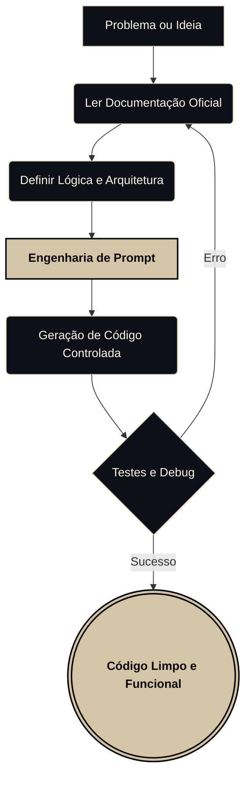

<div align="right">
  <strong>Português</strong> | <a href="README-en.md">English</a>
</div>

<div align="center">


```text
██╗  ██╗       ██████╗ ██████╗ ██████╗ ███████╗██████╗ 
██║  ██║      ██╔═══██╗██╔══██╗██╔══██╗██╔════╝██╔══██╗
███████║█████╗██║   ██║██████╔╝██║  ██║█████╗  ██████╔╝
██╔══██║╚════╝██║   ██║██╔══██╗██║  ██║██╔══╝  ██╔══██╗
██║  ██║      ╚██████╔╝██║  ██║██████╔╝███████╗██║  ██║
╚═╝  ╚═╝       ╚═════╝ ╚═╝  ╚═╝╚═════╝ ╚══════╝╚═╝  ╚═╝
```

[](#)
[](#)
[](#)

<br>

### DESENVOLVEDOR BACKEND & ENGENHARIA DE PROMPT

</div>

---

## SOBRE MIM

Tenho 15 anos e sou apaixonado por lógica, backend e automação. 

Comecei quebrando a cabeça com scripts no Termux e aprendi na prática que copiar e colar código de Inteligência Artificial não funciona. Para construir algo real, você precisa entender a base.

Meu foco atual é usar **Engenharia de Prompt** de forma técnica. Em vez de pedir para a IA "fazer um sistema", eu leio a documentação, defino a arquitetura, crio regras estritas e uso a IA apenas como um motor de geração de código controlado. 

---

## MINHA STACK E FERRAMENTAS

Não acredito em listar 20 linguagens sem ter projetos para provar. Aqui está o que eu realmente uso e o que estou aprendendo:

### Core (O que eu uso no dia a dia)
*   **IA & Prompt Engineering:** ChatGPT, Claude (Foco em RAG e redução de alucinações).
*   **Linguagens:** Python, JavaScript, Node.js.
*   **Dados:** JSON, YAML.

### Explorando / Estudando (Onde estou me aprofundando)
*   **Linguagens de Baixo/Médio Nível:** C, C++, Java.
*   **Frontend:** React, TypeScript, HTML, CSS.

---

## COMO EU DESENVOLVO (MEU CICLO)

Meu processo para evitar bugs e código inútil gerado por IA:



---

## EM CONSTRUÇÃO (MEU LABORATÓRIO)

Atualmente estou organizando meus scripts locais e estudos para publicar aqui no GitHub. Em breve, esta seção será atualizada com projetos reais focados em:

### 1. [Em Breve] Automação com Python
*   **Foco:** Criação de scripts para automatizar tarefas repetitivas usando APIs externas.

### 2. [Em Breve] Integração de IA com Node.js
*   **Foco:** Um backend simples que consome a API da OpenAI/Anthropic com regras estritas de prompt.

### 3. [Em Breve] Estudos em C/C++
*   **Foco:** Algoritmos básicos e entendimento de gerenciamento de memória para fortalecer minha base lógica.

<br>
<div align="center">
  
</div>
